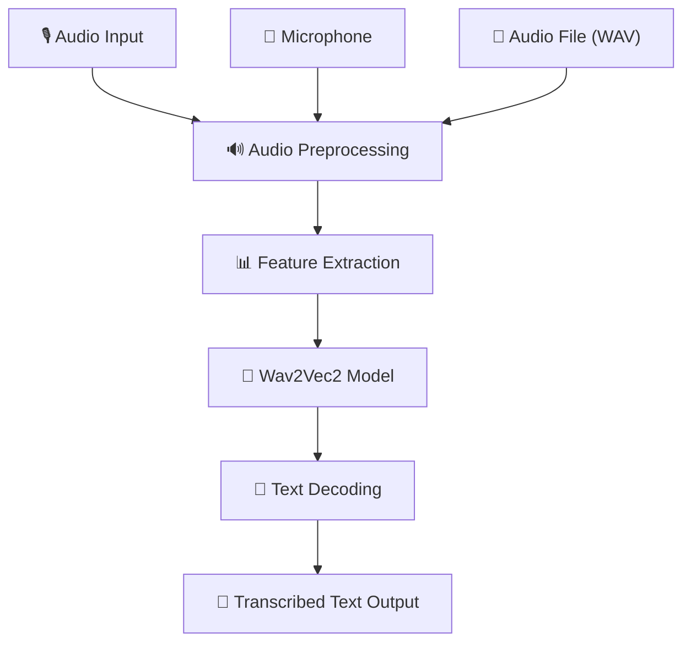

<div align="center">

# 🎤 Speech Recognition System

# Deep Learning Powered Speech-to-Text Conversion

## Speak. Transcribe. Understand. 🎧

</div>

---

<p align="center">


</p>

---

# 📖 Project Description

The **Speech Recognition System** is a Python-based application that automatically converts spoken audio into readable text. Developed using foundational Natural Language Processing (NLP) and Automatic Speech Recognition (ASR) techniques, this tool helps users transcribe voice data with high accuracy. It is designed to simplify tasks that involve capturing and documenting spoken content.

---

# ✨ Key Highlights

- 🎤 Speech-to-Text Transcription
- 🧠 Wav2Vec2 Deep Learning Model
- 🎙️ Microphone & Audio File Support
- ⚡ Real-Time Transcription Capability
- 📄 Clean Text Output
- 💻 Command-Line Interface
- 🔧 No Training Required
- 📁 WAV File Processing

---

# 🏗 System Architecture



---

### 🔄 How It Works

1. User provides audio input (microphone or WAV file).
2. Audio is loaded and preprocessed.
3. Features are extracted from audio waveform.
4. Wav2Vec2 model processes the audio features.
5. Model decodes audio into text tokens.
6. Text is post-processed and displayed.

---

# ✨ Core Features

## 🎤 Speech-to-Text Transcription
- Wav2Vec2 deep learning model
- High accuracy transcription
- English language support

---

## 🎙️ Flexible Input Options

| Input Type | Support |
|:---|:---:|
| Microphone | ✅ Real-time |
| WAV Files | ✅ Batch |
| Audio Formats | WAV |

---

## ⚡ Real-Time Transcription
- Live microphone capture
- Instant text output
- Low latency processing

---

## 📄 Clean Text Output
- Readable transcription
- Word-level accuracy
- Easy to document

---

# 🛠 Technology Stack

| Layer | Technology |
|:---|:---|
| Programming Language | Python 3.11 |
| ASR Model | HuggingFace Wav2Vec2 |
| Deep Learning | PyTorch |
| Audio Processing | Torchaudio, Librosa |
| Input Capture | SpeechRecognition |
| File Handling | SoundFile |
| Deployment | Local / CLI |
| Version Control | Git & GitHub |

---

# 📂 Project Structure

```text
SPEECH-RECOGNITION-SYSTEM/
│
├── speech_to_text.py                       # Main Application
├── requirements.txt                    # Dependencies
├── README.md                           # Documentation
└── .gitignore                          # Git Ignore
```

---

# 📸 Application Preview


---

# ⚙ Installation

## Prerequisites

- Python 3.11+
- pip

---

### Clone Repository

```bash
git clone https://github.com/Keya3639/SPEECH-RECOGNITION-SYSTEM.git

cd SPEECH-RECOGNITION-SYSTEM
```

---

### Install Dependencies

```bash
pip install -r requirements.txt
```

---

### Run Application

```bash
python transcribe.py
```

---

# 🚀 Demo Workflow

| Step | Action |
|:--:|:---|
| 1 | Choose Input (Microphone or WAV) |
| 2 | Speak or Select Audio File |
| 3 | Process Audio |
| 4 | View Transcribed Text |
| 5 | Copy or Save Output |

---

# 📈 Advantages

- ✅ High accuracy on English audio
- ✅ Flexible input options
- ✅ No GPU required for basic tasks
- ✅ Offline-capable with local model
- ✅ Open-source and extendable

---

# ⚠️ Limitations

- English-only support
- No punctuation in raw output
- Background noise affects quality
- Latency on low-performance systems
- Requires internet for model download

---

# 🌟 Real-Time Applications

- 🗣️ Voice Assistants
- 📝 Lecture & Meeting Transcription
- ♿ Accessibility Solutions
- 📞 Customer Service Transcription
- 🎬 Content Creation
- 📋 Interview Documentation

---

# 🔮 Future Enhancements

| Phase | Features |
|:---|:---|
| Phase 1 | Punctuation restoration |
| Phase 2 | Multilingual support |
| Phase 3 | Speaker diarization |
| Phase 4 | MP3/MP4/Streaming input |
| Phase 5 | GUI/Web interface |
| Phase 6 | API-based deployment |

---

# 👩‍💻 Developer

## Keya Das

**MCA (Artificial Intelligence & Data Science)**

🌐 **GitHub**

https://github.com/Keya3639

📧 **Email**

keyakarunamoydas@gmail.com

---

<div align="center">

# 🎤 Speech Recognition System

### Speak. Transcribe. Understand. 🎧

<br>

**Built with ❤️ using**

**Python • HuggingFace Wav2Vec2 • PyTorch • Torchaudio • SpeechRecognition**

<br>

</div>
